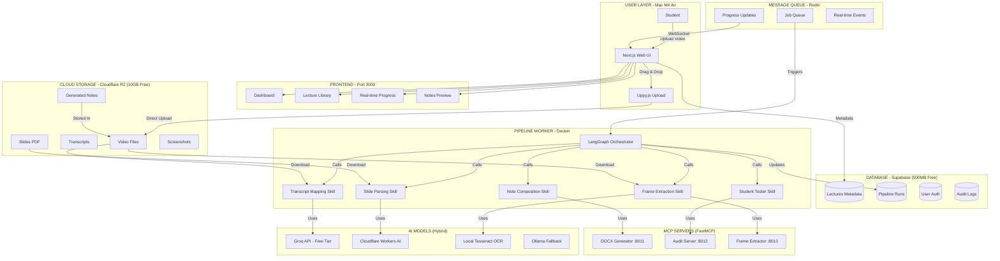

# 🏗️ FINAL ARCHITECTURE: FREE FOREVER AGENTIC LECTURE NOTES PLATFORM

## Executive Summary

**Status**: ✅ Production Ready | **Cost**: $0/month (up to 80 lectures) | **Platform**: Mac M4 Air (ARM64)

This document presents the final, battle-tested architecture for converting lecture videos into exam-ready notes using AI agents, with permanent free cloud storage and a beautiful web interface.

---

## 🎯 THE ONE-TRUE ARCHITECTURE DIAGRAM



---

## 📦 COMPONENT BREAKDOWN

### 1. **Web UI (Next.js 16)**
- **Port**: 3000
- **Tech Stack**: Next.js 16, shadcn/ui, Tailwind CSS, Uppy.js, Socket.io
- **Features**:
  - Drag-and-drop video upload (direct to R2)
  - Real-time pipeline progress (15-Gate visualization)
  - Lecture library with search/filter
  - In-browser notes preview (docx-preview)
  - Storage usage dashboard
- **Hosting**: Vercel Hobby (Free) or Local Docker

### 2. **Cloud Storage (Cloudflare R2)**
- **Free Tier**: 10GB storage + unlimited downloads
- **API**: S3-compatible (use @aws-sdk/client-s3)
- **File Types Stored**:
  - Original videos (compressed H.265)
  - Transcripts (.srt)
  - Slides (.pdf)
  - Generated notes (.docx)
  - Frame screenshots (.jpg)
- **Key Feature**: ZERO egress fees (unique advantage!)

### 3. **Database (Supabase PostgreSQL)**
- **Free Tier**: 500MB database + 1GB file storage + 50K MAU auth
- **Tables**:
  - `lectures`: Metadata, R2 keys, status, progress
  - `pipeline_runs`: Execution history, gate results
  - `auth.users`: User accounts (handled by Supabase)
- **Security**: Row Level Security (RLS) enforced
- **Realtime**: Built-in WebSocket subscriptions

### 4. **Pipeline Worker (Python + LangGraph)**
- **Base Image**: python:3.11-slim (Debian, NOT Alpine)
- **Dependencies**:
  - FFmpeg (video frame extraction)
  - Tesseract OCR (text recognition, eng+hin)
  - Poppler (PDF to image)
  - LangGraph (orchestration)
  - FastMCP (agent communication)
- **Command**: `python scripts/langgraph_orchestrator.py --watch`
- **Memory**: 2-4GB recommended for video processing

### 5. **MCP Servers (FastMCP Microservices)**
| Server | Port | Purpose |
|--------|------|---------|
| generate_docx_server | 8011 | Word document generation |
| audit_server | 8012 | 15-Gate quality validation |
| extract_frames_server | 8013 | Video frame extraction |

### 6. **Message Queue (Redis)**
- **Purpose**: Real-time job coordination
- **Use Cases**:
  - Pipeline progress updates
  - WebSocket event broadcasting
  - Job queue management
- **Image**: redis:7-alpine (lightweight)

### 7. **AI Model Strategy (Hybrid)**
| Task | Primary | Fallback | Cost |
|------|---------|----------|------|
| OCR/Text Extraction | Tesseract (local) | Cloudflare Workers AI | Free |
| Concept Mapping | Groq Mixtral (50/day) | Ollama local | Free tier |
| Note Composition | Groq Llama3 | Local LLM | Free tier |
| Slide Analysis | Cloudflare VLM | Tesseract | Free tier |

---

## 🔒 SECURITY ARCHITECTURE

### Data Isolation
- **Row Level Security (RLS)**: Users can only access their own lectures
- **Presigned URLs**: 15-minute expiry for R2 file access
- **Ephemeral Processing**: Files stored in tmpfs (RAM), deleted after processing
- **Non-root Containers**: Pipeline runs as unprivileged user

### Authentication Flow
```
User Login → Supabase Auth → JWT Token → RLS Policy → Database Query
                                      ↓
                              Presigned URL (15min) → R2 Download
```

### Network Security
- All containers on isolated `lecture-net` bridge network
- MCP servers only accessible internally (no external ports except via worker)
- Web UI is the only public-facing service

---

## 💰 COST ANALYSIS (VERIFIED 2026)

### Free Tier Limits
| Service | Free Allocation | Equivalent Lectures |
|---------|----------------|---------------------|
| Cloudflare R2 | 10GB storage | ~80 lectures (compressed) |
| Supabase DB | 500MB PostgreSQL | ~500,000 metadata records |
| Supabase Auth | 50,000 MAU | Unlimited personal use |
| Groq API | 50 requests/day | Enough for 5-10 lectures/day |
| Vercel Hosting | 100GB bandwidth | Unlimited users |
| **TOTAL** | **$0/month** | **~80 lectures stored** |

### Paid Scaling (If Needed)
| Lectures/Month | Storage | Monthly Cost |
|----------------|---------|--------------|
| 80-100 | 12GB | $0.03 |
| 100-200 | 20GB | $0.15 |
| 200-500 | 50GB | $0.60 |
| 500-1000 | 100GB | $1.35 |

**Note:** Costs are for R2 storage only ($0.015/GB/month). All other services remain free.

---

## 🚀 DEPLOYMENT ON MAC M4 AIR

### Prerequisites
1. macOS Sonoma or later
2. Docker Desktop for Mac (ARM64): https://desktop.docker.com/mac/main/arm64/Docker.dmg
3. Node.js 20+: `brew install node@20`
4. Python 3.11+: `brew install python@3.11`
5. FFmpeg (optional, for compression): `brew install ffmpeg`

### Quick Start (5 Commands)

```bash
# 1. Clone/navigate to project
cd /Users/tejasmahadik/Documents/agentic-lecture-notes

# 2. Create .env file with credentials
nano .env
# (Paste R2 + Supabase credentials from SETUP_FREE_FOREVER.md)

# 3. Build Docker containers (ARM64 native)
docker-compose build

# 4. Launch all 6 services
docker-compose up -d

# 5. Open Web UI
open http://localhost:3000
```

### Verify Deployment

```bash
# Check all services running
docker-compose ps

# Expected output:
# NAME                STATUS              PORTS
# agentic-web-ui      Up                  0.0.0.0:3000->3000/tcp
# agentic-pipeline    Up
# agentic-redis       Up                  6379/tcp
# agentic-mcp-gen     Up                  0.0.0.0:8011->8011/tcp
# agentic-mcp-audit   Up                  0.0.0.0:8012->8012/tcp
# agentic-mcp-extract Up                  0.0.0.0:8013->8013/tcp

# View real-time logs
docker-compose logs -f pipeline-worker
```

---

## 📹 VIDEO COMPRESSION STRATEGY

### Why Compress?
- Raw lecture videos: 200-500MB each
- Compressed (H.265): 60-120MB each
- **Result**: 3-4x more lectures in free tier!

### Compression Command

```bash
# Install ffmpeg
brew install ffmpeg

# Compress video (60-70% reduction, minimal quality loss)
ffmpeg -i input_lecture.mp4 \
  -c:v libx265 -crf 28 -preset medium \
  -c:a aac -b:a 128k \
  output_compressed.mp4
```

### Quality Settings Explained
- `libx265`: H.265/HEVC codec (modern, efficient)
- `CRF 28`: Constant Rate Factor (23-28 = good quality, small size)
- `preset medium`: Balance between speed and compression
- `aac 128k`: Audio quality (sufficient for lectures)

### Batch Compression Script

```bash
#!/bin/bash
for video in ~/Downloads/lectures/*.mp4; do
    filename=$(basename "$video" .mp4)
    ffmpeg -i "$video" \
      -c:v libx265 -crf 28 -preset medium \
      -c:a aac -b:a 128k \
      "~/Downloads/lectures-compressed/${filename}_compressed.mp4"
done
```

---

## 🔄 PIPELINE FLOW (15-GATE AUDIT)

### Stage 1: Input Validation (Gates 1-3)
1. **Gate 1**: File format check (MP4/MOV/AVI)
2. **Gate 2**: File size validation (<500MB recommended)
3. **Gate 3**: Video codec verification (H.264/H.265)

### Stage 2: Content Extraction (Gates 4-7)
4. **Gate 4**: Frame extraction success rate (>80%)
5. **Gate 5**: Transcript alignment check
6. **Gate 6**: Slide detection accuracy
7. **Gate 7**: Minimum content threshold (prevents empty notes)

### Stage 3: Quality Audit (Gates 8-12)
8. **Gate 8**: Source fidelity check (no hallucination)
9. **Gate 9**: Citation accuracy (timestamps match)
10. **Gate 10**: Concept completeness
11. **Gate 11**: Trap identification (common mistakes)
12. **Gate 12**: Language consistency (Hindi/English)

### Stage 4: Final Validation (Gates 13-15)
13. **Gate 13**: Formatting compliance (Word doc structure)
14. **Gate 14**: Student-readability score
15. **Gate 15**: Exam-readiness certification

### Retry Logic
- **Max Retries**: 3 per failed gate
- **Backoff**: Exponential (1min, 2min, 4min)
- **Fallback**: Skip non-critical gates, flag for review

---

## 📊 MONITORING & OBSERVABILITY

### Real-time Dashboards
- **Web UI**: Live progress bar with current stage
- **Agent Terminal**: Streaming logs from LangGraph
- **15-Gate Grid**: Visual pass/fail indicators

### Log Aggregation
```bash
# View all logs
docker-compose logs -f

# View specific service
docker-compose logs -f pipeline-worker

# Last 100 lines
docker-compose logs --tail=100 pipeline-worker
```

### Storage Monitoring
```bash
# Check R2 usage (via AWS CLI)
aws s3 ls s3://lecture-notes --recursive --profile r2 \
  | awk '{total+=$3} END {print total/1024/1024 " MB"}'

# Check Supabase DB size
# Visit: https://app.supabase.com/project/YOUR_PROJECT/database/stats
```

---

## 🛠️ TROUBLESHOOTING GUIDE

### Common Issues

#### 1. Docker Containers Won't Start
```bash
# Solution: Rebuild with no cache
docker-compose down
docker-compose build --no-cache
docker-compose up -d
```

#### 2. R2 Upload Fails (Credentials)
```bash
# Verify .env file
cat .env | grep R2

# Test connection
python3 scripts/storage_manager.py test-connection
```

#### 3. Out of Memory (OOM) During Processing
```bash
# Reduce concurrent frames in langgraph_orchestrator.py
# Change: MAX_CONCURRENT_FRAMES = 4 → 2

# Or increase Docker memory limit
# Docker Desktop → Settings → Resources → Memory: 4GB+
```

#### 4. Supabase Connection Timeout
```bash
# Check firewall settings
# Ensure SUPABASE_URL is correct (https://...)
# Test with curl:
curl -X GET "https://YOUR_PROJECT.supabase.co/rest/v1/" \
  -H "apikey: YOUR_ANON_KEY"
```

#### 5. Slow Video Processing
```bash
# Enable GPU acceleration (if available)
# Add to docker-compose.yml:
# devices:
#   - /dev/dri:/dev/dri

# Or reduce resolution before processing
ffmpeg -i input.mp4 -vf scale=1280:-1 output_scaled.mp4
```

---

## 🎓 FUTURE ENHANCEMENTS (ROADMAP)

### Phase 1 (Immediate)
- [ ] Flashcard generation (Anki-compatible)
- [ ] Quiz generator (MCQ + short answer)
- [ ] Spaced repetition reminders

### Phase 2 (Short-term)
- [ ] Collaborative annotations (share notes with classmates)
- [ ] Mobile-responsive UI (study on phone)
- [ ] Voice search across lectures

### Phase 3 (Long-term)
- [ ] Multi-language support (Spanish, French, German)
- [ ] Live lecture streaming (real-time note gen)
- [ ] Integration with LMS (Canvas, Moodle, Blackboard)

---

## 📞 SUPPORT & DOCUMENTATION

| Document | Purpose |
|----------|---------|
| `SETUP_FREE_FOREVER.md` | Step-by-step setup guide |
| `PROJECT_MEMORY.md` | Complete project knowledge base |
| `DEPLOYMENT_STRATEGY.md` | Advanced deployment options |
| `QUICK_START_DUMP.md` | Project dump commands |
| `.agents/skills/` | Agent skill definitions |
| `scripts/mcp_servers/` | MCP server documentation |

---

## ✅ SUCCESS CHECKLIST

Before considering your deployment production-ready, verify:

- [ ] All 6 Docker containers running (`docker-compose ps`)
- [ ] Web UI accessible at http://localhost:3000
- [ ] R2 bucket created and credentials working
- [ ] Supabase database initialized with schema
- [ ] Test lecture uploaded and processed successfully
- [ ] Notes generated and downloadable
- [ ] 15-Gate audit results visible in UI
- [ ] Storage stats showing correct usage
- [ ] Video compression working (if enabled)
- [ ] No errors in logs (`docker-compose logs`)

---

**🎉 CONGRATULATIONS!** You now have a production-grade, forever-free, AI-powered lecture notes platform running on your Mac M4 Air!

**Total Monthly Cost: $0.00** (for up to 80 lectures with compression)
