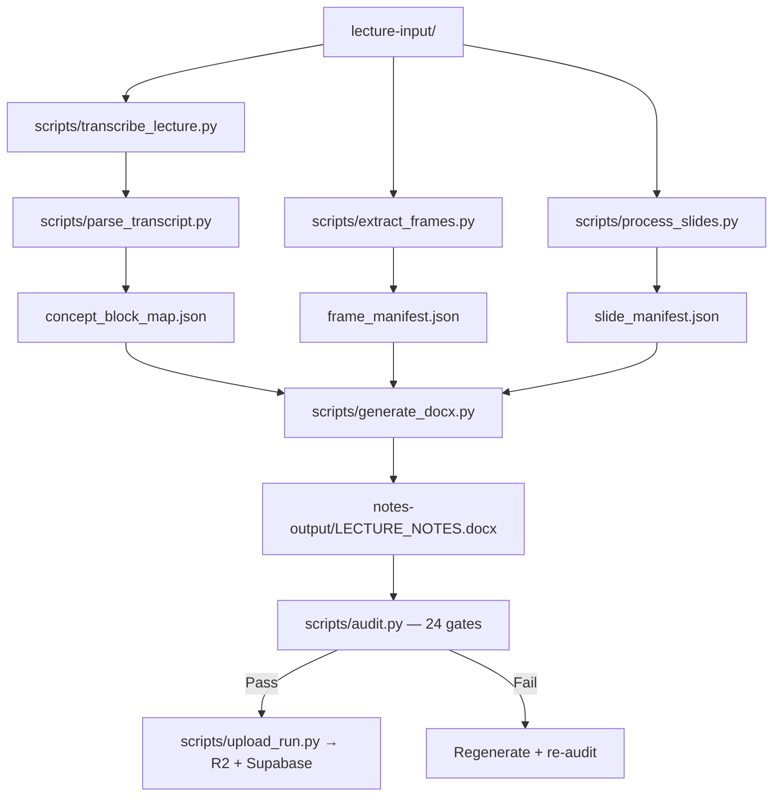

# Agentic Lecture Notes — Master Agent Handoff Prompt

This file is the **single source of truth** for initializing any AI agent (Antigravity, Claude Code, Cursor, Claude Desktop) on this project. Copy the relevant prompt section, fill in the placeholders, and send it to the agent.

> **Last Updated**: 2026-07-10
> **Gate Count**: 24 (authoritative source: `scripts/audit.py`)
> **Workspace State**: `workspace_state.json` (always read this first)

---

## Quick Start Checklist for Any New Agent

Before doing **anything**, read these files in order:
1. `workspace_state.json` — current pipeline state, active lecture, audit score
2. `CLAUDE.md` — source fidelity protocol (v8.0), note generation rules, output format spec
3. `AGENTS.md` — orchestrator + sub-agent roles, all hardened constraints
4. `CROSS_PLATFORM.md` — MCP server setup for Claude Code, Cursor, Desktop
5. `docs/ISSUES_REGISTRY.md` — active bugs, risks, and priority queue

---

## Section 1: Copy-Paste Master Prompt — Standard Lecture Reconstruction

```text
Act as the Lecture Note Reconstruction Orchestrator for the agentic-lecture-notes pipeline.

Your working directory is: /Users/tejasmahadik/Documents/agentic-lecture-notes

### 1. Active Lecture Sources
Run the pipeline on the following source files:
- Video (.mp4): [REPLACE_WITH_VIDEO_PATH_OR_NONE]
- Slides (.pdf/.pptx): [REPLACE_WITH_SLIDES_PATH_OR_NONE]
- Reference Notes (.pdf): [REPLACE_WITH_REFERENCE_NOTES_PATH_OR_NONE]
- Transcript (.srt/.txt/.vtt): [REPLACE_WITH_TRANSCRIPT_PATH_OR_NONE]

### 2. Startup Inspection & State Recovery
Before executing any steps:
1. Read the workspace root files:
   - CLAUDE.md (source fidelity protocol + note rules)
   - AGENTS.md (orchestrator and sub-agent roles, hardened constraints)
   - .agents/rules/note-style.md (math formatting, styling guidelines)
   - docs/ISSUES_REGISTRY.md (active issues and fixes)
2. Read `workspace_state.json` to inspect the pipeline's last checkpoint.
3. Verify the virtual environment: `source venv/bin/activate && python --version`

### 3. Transcript Acquisition (if transcript missing)
If no transcript is provided:
1. Check `~/Downloads/` for a matching `.srt` or `.txt` file.
2. Check `~/SoundScribe/` for a matching `.soundscribejob` directory:
   - Read `manifest.json`
   - Convert sample-based timestamps to seconds by dividing `startSample` and `endSample` by `16000` Hz
   - Format to standard SRT timestamps (HH:MM:SS,mmm)
   - Save as `lecture-input/transcript.srt`
3. If neither exists, let the orchestrator run Qwen3-ASR offline transcription via `scripts/transcribe_lecture.py`.

### 4. Pipeline Execution Constraints
1. **Title Ingestion**: Write the clean lecture filename to `lecture-input/lecture_title.txt` and pass it via `--lecture-title` to ensure correct heading propagation.
2. **XML Tag Formatting**: Use single quotes for attributes inside JSON strings (e.g. `<highlight color='BLUE'>`) to prevent JSON syntax errors.
3. **Chronological Range Coverage (Gate 20)**: Map `transcript_range_percent` based on outer chunk boundaries, not individual example timestamps.
4. **Devanagari Ban (Gate 21)**: Absolutely no Devanagari script characters in any JSON field or notes output. Translate or Romanize all Hindi.
5. **Styling Conformity (Gate 22)**: No native Word highlights; use pastel run shading. Quick Revision boxes use `#D6EAF8`, Student Note boxes use `#F0F4F8`.
6. **Word Count Budget (Gate 23)**: Scale word count dynamically based on concept blocks and examples. Target 2,500–3,500 for 1hr lecture (hard ceiling 4,000).
7. **Callout Box Cap (Gate 24)**: Maximum 20 callout boxes (traps/tricks/cautions/quotes) per document.
8. **Redundant Archives Prevention**: Archive only on success. Run grouping-based cleanup to keep exactly one timestamped archive per distinct lecture.
9. **Universal Anti-Bloat Rules**:
   - **Strict Attribution Ban**: Never write "the teacher explains" or "in this section we learn". State facts directly.
   - **Point-Wise Clarity**: Any concept taking > 3 sentences to explain MUST be a bulleted list or markdown table.
   - **Progressive Bolding**: Extensively bold the `**most critical keywords**` for 5-minute skimming.
10. **Run Pipeline**:
   ```bash
   source venv/bin/activate
   python3 scripts/langgraph_orchestrator.py
   ```
10. **Run Audit**:
    ```bash
    venv/bin/python scripts/audit.py --docx notes-output/LECTURE_NOTES.docx
    ```
    All **24 quality gates** must pass.

### 5. Handoff Protocol
Upon completion or failure, update `workspace_state.json` with:
- `active_lecture`: title, paths, fingerprint
- `pipeline`: current_stage, status_message, failed_gate
- `artifacts`: concept_map, frame_manifest, notes_output, notes_output_meta
- `audit`: score (out of 24), failed_gates list, last_checked timestamp

Report the final run status, the audit score, and point to the generated Word document in `notes-output/`. Do not output notes text in chat.
```

---

## Section 2: Copy-Paste Master Prompt — Handwritten Reference Notes Ingestion

```text
Act as the Lecture Note Reconstruction Orchestrator for the agentic-lecture-notes pipeline.

Your working directory is: /Users/tejasmahadik/Documents/agentic-lecture-notes

### 1. Active Lecture Sources
- Video (.mp4): [REPLACE_WITH_VIDEO_PATH_OR_NONE]
- Slides (.pdf/.pptx): [REPLACE_WITH_SLIDES_PATH_OR_NONE]
- Reference Notes / User Corrected Notes (.pdf): [REPLACE_WITH_REFERENCE_NOTES_PATH]
- Transcript (.srt/.txt/.vtt): [REPLACE_WITH_TRANSCRIPT_PATH_OR_NONE]

### 2. Handwritten Corrections & Ingestion Protocol
The "Reference Notes" PDF contains the user's handwritten notes, warnings, and corrections.
Follow this protocol with 100% fidelity:
1. **Handwriting OCR**: Parse every page using OCR. Read all handwriting, corrections, side-notes. Integrate chronologically into concept blocks.
2. **Corrections Priority Override**: Treat handwritten notes as absolute corrections. Discard default AI logic where the user marks something incorrect. Re-write using the teacher's/user's exact steps.
3. **Screenshot Extraction Constraint**: Extract only embedded image assets (screenshots/diagrams > 400x100 px) using PyMuPDF coordinate crop filters. Do NOT take full-page screenshots of handwritten pages.
4. **Video Frame Integration**: Use video frames for primary board screenshots, aligned with corrected concepts chronologically.

### 3. Styling & Tone Guidelines
1. **Attribution Ban**: Never write "the teacher says/explains/mentions". State facts directly.
2. **Childish Language Elimination**: Present information directly in analytical prose.
3. **English Enforcement (Gate 21)**: No Devanagari characters. Hindi/Hinglish only when an English concept needs a specific Hindi analogy.
4. **Teacher's Emphasis**: Use `⭐ **[IMPORTANT]**` for emphasized points.
5. **XML Tag Formatting**: Single quotes for all attributes inside JSON strings.

### 4. Pipeline Execution & Self-Audit
1. Write lecture title to `lecture-input/lecture_title.txt` and pass via `--lecture-title`.
2. Run pipeline: `venv/bin/python scripts/langgraph_orchestrator.py`
3. Run 24-gate audit: `venv/bin/python scripts/audit.py --docx notes-output/LECTURE_NOTES.docx`
4. Resolve failures and regenerate as needed. Update `workspace_state.json` and report status.
```

---

## Section 3: Scheduled Daily Ingestion & Automation (Cron Spec)

### Setup in Antigravity UI
| Field | Configuration |
| :--- | :--- |
| **Name** | `Daily Lecture Ingestion and Note Reconstruction` |
| **Project** | `Agentic Lecture notes Final` |
| **Schedule** | `Daily` around `9:00 AM` (within 7 AM – 1 PM window) |
| **Prompt** | Copy the prompt block from Section 3.1 below |

### 3.1 Copy-Paste Scheduled Task Prompt

```text
Role: Daily Lecture Note Ingestor and Quality Auditor

Task:
Every day at 9:00 AM, scan ~/Downloads for raw lecture videos (.mp4), match support slides and reference notes, run the note reconstruction pipeline, verify the 24-gate quality audit, upload results to Cloud R2/Supabase, and purge local downloads under strict 2-phase commit rules.

---

### Phase 1: Ingestion & File Association
1. Scan `~/Downloads/` for `.mp4` video files.
2. Match PDFs by lecture number tokens (Lec-12, Live-12, etc.):
   - Mismatched lecture numbers must NEVER be grouped together.
   - Scan PDF contents to verify topic relevance (e.g., Multiplexing video ≠ Closure Properties PDF).
   - Skip files still downloading (`.crdownload`, `.part`, unstable size).
3. Check transcripts:
   - Look in `~/Downloads/` for matching `.srt`/`.txt`.
   - Fallback: check `~/SoundScribe/` for `.soundscribejob` directory → read manifest.json → convert timestamps (÷16000 Hz) → save as `lecture-input/transcript.srt`.
   - If neither exists, let orchestrator run Qwen3-ASR.

---

### Phase 2: Pipeline Execution
1. Run downloads tracker: `venv/bin/python scripts/downloads_tracker.py --retry-failed`
2. The tracker validates ≥15 GB free disk space, cleans lecture-input cache, copies files, and runs `scripts/langgraph_orchestrator.py`.

---

### Phase 3: Note Quality Constraints
1. **Word Count**: 2,500–3,500 words for 1hr lecture (ceiling 4,000).
2. **Topic Isolation**: H2 headings match lecture/slide headings exactly. No fuzzy merging.
3. **Worked Examples**: Step-by-step, original equations first, then simplified. Homework labeled as "HW Que: Try:".
4. **Highlighting**: Bold key terms. Use `<highlight color="BLUE/RED/PURPLE/ORANGE">`. No neon yellow/green.
5. **Cautions**: Only teacher-mentioned traps/tricks. Max 6 per document. Max 20 total callout boxes.
6. **Math Layout**: Separate lines per algebra step.
7. **Universal Anti-Bloat Rules**:
   - **Strict Attribution Ban**: Never write "the teacher explains" or "in this section we learn". State facts directly.
   - **Point-Wise Clarity**: Any concept taking > 3 sentences to explain MUST be a bulleted list or markdown table.
   - **Progressive Bolding**: Extensively bold the `**most critical keywords**` for skimming.

---

### Phase 4: Safe 2-Phase Commit Purge
Do NOT delete files from ~/Downloads/ unless ALL three conditions are met:
1. 24-gate audit passes (exit code 0): `venv/bin/python scripts/audit.py --docx notes-output/LECTURE_NOTES.docx`
2. R2 `head_object` confirms non-zero byte upload
3. Supabase logs `'completed'` status

Safety checks:
- `os.path.realpath` verifies paths are inside `~/Downloads/`
- Symlinks are strictly banned

---

### Phase 5: Notifications
- Send macOS desktop notification ONLY on pipeline failure or low disk space (error-only policy).
```

---

## Section 4: System Architecture & Key Scripts

### Pipeline Flow


### Key Scripts
| Script | Purpose |
|---|---|
| `scripts/langgraph_orchestrator.py` | LangGraph state machine — runs the full pipeline end-to-end |
| `scripts/parse_transcript.py` | AI-powered transcript → concept_block_map.json |
| `scripts/generate_docx.py` | Concept map + frames → styled .docx |
| `scripts/audit.py` | 24-gate mechanical quality audit |
| `scripts/extract_frames.py` | Video → windowed candidate frames with OCR |
| `scripts/process_slides.py` | PDF slides → slide_manifest.json + OCR |
| `scripts/transcribe_lecture.py` | Qwen3-ASR offline transcription |
| `scripts/soundscribe_fallback.py` | SoundScribe → SRT conversion fallback |
| `scripts/downloads_tracker.py` | Automated daily scanner + pipeline runner |
| `scripts/upload_run.py` | Upload notes + video to Cloudflare R2 |
| `scripts/cloud_uploader.py` | Supabase logging with upsert + retry |
| `scripts/cleanup_archives.py` | Archive deduplication/retention |
| `scripts/docx_to_anki.py` | DOCX → Anki CSV flashcard export |
| `scripts/generate_short_note.py` | concept_block_map → revision short note |

### Core Manifests (Root)
| File | Description |
|---|---|
| `concept_block_map.json` | Chronological concept blocks with examples, visual moments, rules |
| `frame_manifest.json` | Extracted video frames with timestamps and OCR text |
| `slide_manifest.json` | Slide OCR text and cross-references |
| `reference_manifest.json` | Handwritten reference note OCR pages |
| `embedded_manifest.json` | Embedded image assets from PDFs |
| `inserted_images.json` | Image tracking for docx generation deduplication |
| `workspace_state.json` | Central pipeline state for agent hand-off |
| `lecture_profile.json` | Lecture type classification metadata |

---

## Section 5: 24 Quality Gates Summary

| Gate | Name | Check |
|---|---|---|
| 1 | Source Map Exists | `concept_block_map.json` present and valid |
| 2 | DOCX Exists | Output `.docx` file present |
| 3 | Heading Hierarchy | Correct H1/H2 structure |
| 4 | Attribution Ban | No "teacher says/explains/mentions" phrases |
| 5 | Worked Examples | Map examples found in document |
| 6 | Visual Coverage | Images present (≥1 per block or proportional) |
| 7 | Content Density | H2 count, image ratio, minimum content |
| 8 | Title Source Trace | Document title matches concept map lecture title |
| 9 | Empty Exercises | No blank exercise placeholders |
| 10 | Example Rendering | Worked examples correctly formatted |
| 11 | Image Count Match | `inserted_images.json` matches actual images |
| 12 | Map Empty Items | No empty examples/concepts in source map |
| 13 | Backtick Leakage | No raw markdown backticks in output |
| 14 | LaTeX/Math Leakage | No raw LaTeX commands in output |
| 15 | Placeholder Text | No "Visual anchor" or placeholder labels |
| 16 | Highlight Format | Highlights use run shading, not native Word highlights |
| 17 | Document Length | Word count within acceptable range |
| 18 | Paragraph Quality | No single-sentence paragraphs, proper formatting |
| 19 | File Size | Reasonable DOCX file size |
| 20 | Transcript Coverage | ≥80% chronological coverage, ≥80% H2 headings found |
| 21 | English Enforcement | No Devanagari, limited Hinglish (≤40 keywords) |
| 22 | Styling Conformity | Pastel shading, correct box colors, no native highlights |
| 23 | Word Count Budget | Dynamic scaling based on concept blocks + examples |
| 24 | Callout Box Cap | ≤20 callout boxes total |

---

## Section 6: Known Learnings & Hard-Won Fixes

These are lessons learned from production runs that any new agent **must** know:

### List Numbering Bug (Grammar/Exercise Lectures)
- **Problem**: Using Word's `List Number` style for question numbering caused numbers to auto-increment across the entire document (e.g., 1→143 instead of restarting per section).
- **Fix**: Use custom indented paragraphs with explicit `f"{q_num}. "` text prefix instead of Word list styles. Never use `List Number` or `List Bullet` styles for question numbering.

### Multi-Part Lecture Handling
- **Rule**: When a lecture is split into Part 1 and Part 2 videos, they are **separate lectures** with separate content. Part 2 is NOT a continuation of Part 1's numbering.
- **Fix**: Generate separate notes for each part. Do not merge or continue numbering from Part 1.

### PDF Question Count Alignment
- **Rule**: Always count the actual questions in the PDF source. If the PDF has 42 questions, the notes must reference 42 questions — not 100+.
- **Fix**: Extract and deduplicate questions from the PDF using OCR, then align concept blocks with the exact count.

### Gate 20 Transcript Coverage
- **Rule**: Block ranges must map to outer chunk boundaries (covering the full transcript span), not shrink to individual example timestamps.
- **Fix**: Set `transcript_range_percent` as `[chunk_start%, chunk_end%]` spanning the full lecture time range.

### Dark Mode / OneNote Compatibility
- **Rule**: All runs with background shading must have explicit text color set to black (`RGBColor(0,0,0)`).
- **Fix**: Prevents OneNote from auto-inverting text to white on pasted shaded blocks.

### Stale Manifest Risks
- **Rule**: When switching lectures, always clear `concept_block_map.json`, `frame_manifest.json`, `slide_manifest.json`, `reference_manifest.json`, `embedded_manifest.json`, and `inserted_images.json`.
- **Fix**: The web upload and orchestrator now clear these on new runs. CLI users must manually verify.

### Custom XML Tag Naming Constraint (Underscore Subscript Bug)
- **Problem**: Custom tags like `<code_inline>` or `<code_block>` contain underscores. When parsed, they match the LaTeX subscript conversion pattern `_([a-zA-Z0-9])`, which converts them into `<code<sub>i</sub>nline>` and `<code<sub>b</sub>lock>`, splitting the tags and rendering them literally as `<codeinline>` and `<codeblock>` in Word.
- **Fix**: Always use tag names WITHOUT underscores (e.g., `<codeinline>` and `<codeblock>`). The parser must normalize potential LLM-generated underscored tags to standard no-underscore tags to prevent subscript matching.

---

## Section 7: Cloud Infrastructure

### Cloudflare R2
- Bucket: configured via `.env` (`R2_BUCKET_NAME`, `R2_ACCOUNT_ID`, `R2_ACCESS_KEY_ID`, `R2_SECRET_ACCESS_KEY`)
- Uploads: notes .docx, video .mp4, transcript .srt, slides .pdf
- Size limit: 9 GB per file

### Supabase
- Table: `pipeline_runs`
- Columns: lecture_title, status, audit_score, failed_gates, notes_url, video_url, created_at
- Uses upsert with 3x exponential backoff retry
- Status must be `'completed'` before any download purge

### Environment Variables (in `.env`)
```
R2_BUCKET_NAME=...
R2_ACCOUNT_ID=...
R2_ACCESS_KEY_ID=...
R2_SECRET_ACCESS_KEY=...
SUPABASE_URL=...
SUPABASE_KEY=...
```

---

## Section 8: Subject-Specific Constraints

These constraints activate **only** when the lecture topic matches:

### Syllogism/Logic Lectures
- "Only A are B" → All B are A (strict exclusivity)
- Surety vs. Possibility: certainty makes possibility FALSE
- "Only a few A are B" → Some A are B AND Some A are not B
- Either-Or: only when same subject/predicate, both individually false, complementary pair

### Permutation & Combination Lectures
- Prioritize Basic Counting Principle over formulas
- OR (mutually exclusive) = add, AND (successive stages) = multiply
- Always Together: treat group as entity, arrange, multiply internal
- Always Included: ^rP_x × ^(n-x)P_(r-x)
- Always Excluded: ^(n-x)P_r
- Vowels Not Together vs. No Two Vowels Together: complementary vs. gap method
- Circular permutations: (n-1)!, necklaces: (n-1)!/2

### Grammar/Sentence Correction Lectures
- Map every preposition/rule variant with corresponding examples
- Do not merge distinct grammar topics under fuzzy headings
- Exercise questions: always align numbering with source PDF
- Homework: label as "HW Que: Try:" — never mix with lecture examples

### DBMS / SQL Lectures
- **Query Formatting**: Ensure all SQL keywords (`SELECT`, `INSERT`, `UPDATE`, `DELETE`, `CREATE TABLE`, `ALTER TABLE`, `DROP`, `TRUNCATE`, `RENAME`, `COMMIT`, `ROLLBACK`, `SAVEPOINT`) are in UPPERCASE and wrapped in `<codeinline>...</codeinline>` tags for Consolas styling.
- **Table Schema Representation**: Render table creations in clean SQL code blocks with appropriate column datatypes (`INT`, `VARCHAR2`, `DATE`) exactly as taught.
- **Execution Order**: Document structural execution of clauses (e.g. `FROM` -> `WHERE` -> `GROUP BY` -> `HAVING` -> `SELECT` -> `ORDER BY`) chronologically using step-by-step numbered lists.
- **DDL vs DML vs TCL distinction**: Clearly distinguish command categories. Note that DDL commands are structural modifications (cannot be rolled back) and DML are tuple/record modifications (can be rolled back via TCL).
