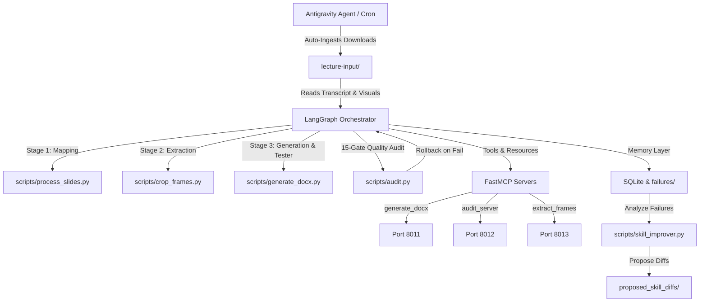

# Agentic Lecture Notes Reconstruction

An autonomous, self-healing, cross-platform pipeline designed to reconstruct lecture materials (video, transcript, slide decks) into exam-ready notes in Word (.docx) format using the v8.0 Source Fidelity Protocol and LangGraph 1.x orchestration.

## Architecture



## How It Works

The note reconstruction pipeline operates autonomously through the following steps:

### 1. Dynamic vs. Fallback Manifest Selection (Topic-Specific Matching)
When a lecture transcript is ingested, the system reads its contents to determine if it matches a known lecture (e.g., searching for "scheduling" to identify the CPU Scheduling lecture).
- **Fallback Manifests**: If a matching known lecture is detected, the orchestrator immediately loads pre-built manifests ([fallback_concept_block_map.json](file:///Users/tejasmahadik/Documents/agentic-lecture-notes/scripts/fallback_concept_block_map.json) and [fallback_frame_manifest.json](file:///Users/tejasmahadik/Documents/agentic-lecture-notes/scripts/fallback_frame_manifest.json)) to skip unnecessary reasoning steps and accelerate execution.
- **Dynamic Manifests**: If the lecture is unknown, the pipeline falls back to dynamic generation, analyzing the transcript and visual assets dynamically.

### 2. Antigravity CLI Integration for Unknown Lectures
For unknown lectures without offline fallbacks, the orchestrator invokes the local `antigravity` CLI tool to analyze the transcript. The CLI reads the transcript at `lecture-input/transcript.srt`, identifies key concept blocks under the v8.0 Source Fidelity Protocol, and extracts visual anchor points, outputting new `concept_block_map.json` and `frame_manifest.json` files dynamically.

### 3. The 4-Hour Scheduler and Heartbeat Timeout
An autonomous cron scheduler runs every 4 hours. It performs the following duties:
- Wakes up and triggers [auto_ingest.sh](file:///Users/tejasmahadik/Documents/agentic-lecture-notes/scripts/auto_ingest.sh) to check for new files.
- If files are found, it copies them and attempts to trigger the reconstruction.
- Incorporates a heartbeat mechanism where the main pipeline execution is monitored. If execution stalls beyond the designated heartbeat threshold, it aborts to prevent resource lockup and writes diagnostic fail logs to `agent_memory/failures/`.

### 4. Timestamped Archive Copies
To ensure work is never overwritten by subsequent runs, every successful execution of [generate_docx.py](file:///Users/tejasmahadik/Documents/agentic-lecture-notes/scripts/generate_docx.py) creates both:
- A primary target notes file at `notes-output/LECTURE_NOTES.docx`.
- A unique, sanitized, and timestamped copy in `notes-output/` (e.g., `LECTURE_NOTES_OSI_Layers_2026-06-06_18-00-00.docx`) based on the lecture title, preserving a complete history of the reconstructed materials.

## Quick-Start

### 1. Installation
Ensure system requirements are met, activate the virtual environment, and install dependencies:
```bash
source venv/bin/activate
pip install -r requirements-mcp.txt
```

### 2. Run Note Reconstruction Pipeline
To trigger the complete, self-healing LangGraph note reconstruction:
```bash
python3 scripts/langgraph_orchestrator.py
```

### 3. Launch Custom MCP Servers
To run the background servers locally using the SSE transport:
```bash
./scripts/start_mcp_servers.sh
```

### 4. Continuous Self-Improvement
Analyze pipeline abort files and propose skill improvements:
```bash
python3 scripts/skill_improver.py
```

For more detailed guides, refer to:
- [CLAUDE.md](file:///Users/tejasmahadik/Documents/agentic-lecture-notes/CLAUDE.md): Notes writing rules and Source Fidelity constraints.
- [CROSS_PLATFORM.md](file:///Users/tejasmahadik/Documents/agentic-lecture-notes/CROSS_PLATFORM.md): IDE integration instructions for Cursor, Claude Code, and Claude Desktop.
- [MCP_SECURITY.md](file:///Users/tejasmahadik/Documents/agentic-lecture-notes/MCP_SECURITY.md): Details on the API-key authentication system.
