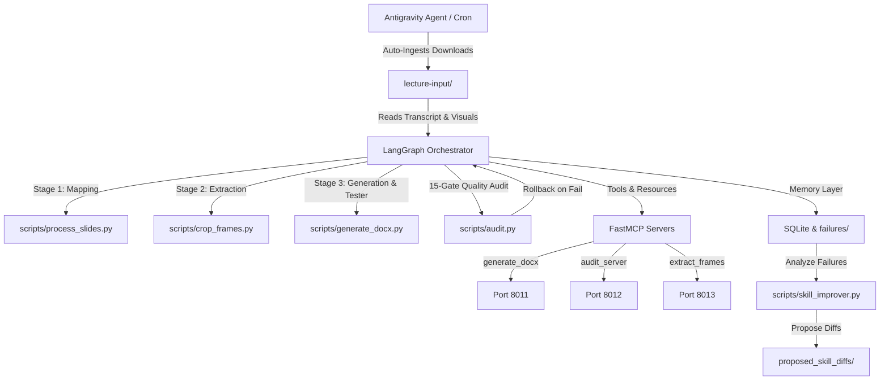

# Agentic Lecture Notes Reconstruction

An autonomous, self-healing, cross-platform pipeline designed to reconstruct lecture materials (video, transcript, slide decks) into exam-ready notes in Word (.docx) format using the v8.0 Source Fidelity Protocol and LangGraph 1.x orchestration.

## Architecture



## Quick-Start

### 1. Installation
Ensure system requirements are met, activate the virtual environment, and install dependencies:
```bash
source venv/bin/activate
pip install -r requirements-mcp.txt
```

### 2. Run Note Reconstruction Pipeline
To trigger the complete, self-healing LangGraph note reconstruction:
```bash
python3 scripts/langgraph_orchestrator.py
```

### 3. Launch Custom MCP Servers
To run the background servers locally using the SSE transport:
```bash
./scripts/start_mcp_servers.sh
```

### 4. Continuous Self-Improvement
Analyze pipeline abort files and propose skill improvements:
```bash
python3 scripts/skill_improver.py
```

For more detailed guides, refer to:
- [CLAUDE.md](file:///Users/tejasmahadik/Documents/agentic-lecture-notes/CLAUDE.md): Notes writing rules and Source Fidelity constraints.
- [CROSS_PLATFORM.md](file:///Users/tejasmahadik/Documents/agentic-lecture-notes/CROSS_PLATFORM.md): IDE integration instructions for Cursor, Claude Code, and Claude Desktop.
- [MCP_SECURITY.md](file:///Users/tejasmahadik/Documents/agentic-lecture-notes/MCP_SECURITY.md): Details on the API-key authentication system.

## 7. Universal AI Compatibility (Any Model, Any Mode)

The project is **Model-Agnostic**. It does not rely on a single AI provider. Instead, it provides a structured context (`AGENTS.md`, `CLAUDE.md`, `SKILL.md`) that allows **ANY** advanced AI to instantly take over operations.

### Supported AI Models
- **Anthropic:** Claude 3.5/3.7 Sonnet, Claude Code, Claude Desktop
- **OpenAI:** Codex 5.5, GPT-4o, ChatGPT Sidebar
- **Google:** Gemini 2.5 Flash, Gemini 3.5 Pro, Gemini Advanced
- **Others:** Qwen 2.5/3.5 Max, DeepSeek V3, Llama 3.3 (via Groq/Ollama)

### Two Operational Modes

#### Mode A: IDE / Sidebar Intervention (Human-in-the-Loop)
*Best for: Complex debugging, first-time concept mapping, creative note structuring.*

1.  **Open Project:** Open `agentic-lecture-notes` in Cursor, VS Code (Copilot), or Claude Code terminal.
2.  **AI Reads Context:** The AI automatically reads `.agents/skills/*.md` and `CLAUDE.md`.
3.  **Execute via Chat:**
    *   *User:* "Process the new lecture in Downloads using the Frame Extraction skill."
    *   *AI:* Reads the skill, runs `python3 scripts/extract_frames.py`, and reports results.
4.  **No API Keys Needed:** Uses the AI's existing session authentication.

#### Mode B: Autonomous API Execution (Headless)
*Best for: Scheduled runs, batch processing, overnight generation.*

1.  **Configure:** Set `GEMINI_API_KEY` or `GROQ_API_KEY` in `.env`.
2.  **Run Pipeline:** `python3 scripts/langgraph_orchestrator.py`.
3.  **AI Integration:** The script calls `scripts/ai_services.py`, which routes tasks to the configured API provider.
4.  **Fallback Chain:** If Gemini fails, it tries Groq → Ollama → Local Fallback.

### How New AIs Take Over
If you open this project in a **new AI environment** (e.g., switching from Claude Code to Codex 5.5):
1.  **Read `AGENTS.md`:** Defines the Orchestrator role.
2.  **Read `CLAUDE.md`:** Contains the immutable Source Fidelity Protocol.
3.  **Read `SKILL.md` files:** Step-by-step instructions for each task.
4.  **Start Working:** The AI can immediately run scripts, debug errors, or generate notes using its native capabilities.
