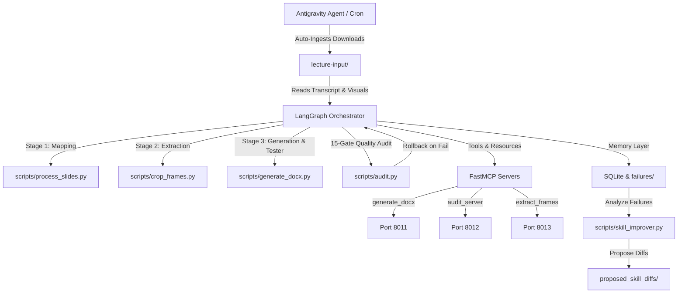

# Agentic Lecture Notes Reconstruction

An autonomous, self-healing, cross-platform pipeline designed to reconstruct lecture materials (video, transcript, slide decks) into exam-ready notes in Word (.docx) format using the v8.0 Source Fidelity Protocol and LangGraph 1.x orchestration.

## Architecture



## Quick-Start

### 1. Installation
Ensure system requirements are met, activate the virtual environment, and install dependencies:
```bash
source venv/bin/activate
pip install -r requirements-mcp.txt
```

### 2. Run Note Reconstruction Pipeline
To trigger the complete, self-healing LangGraph note reconstruction:
```bash
python3 scripts/langgraph_orchestrator.py
```

### 3. Launch Custom MCP Servers
To run the background servers locally using the SSE transport:
```bash
./scripts/start_mcp_servers.sh
```

### 4. Continuous Self-Improvement
Analyze pipeline abort files and propose skill improvements:
```bash
python3 scripts/skill_improver.py
```

For more detailed guides, refer to:
- [CLAUDE.md](file:///Users/tejasmahadik/Documents/agentic-lecture-notes/CLAUDE.md): Notes writing rules and Source Fidelity constraints.
- [CROSS_PLATFORM.md](file:///Users/tejasmahadik/Documents/agentic-lecture-notes/CROSS_PLATFORM.md): IDE integration instructions for Cursor, Claude Code, and Claude Desktop.
- [MCP_SECURITY.md](file:///Users/tejasmahadik/Documents/agentic-lecture-notes/MCP_SECURITY.md): Details on the API-key authentication system.
