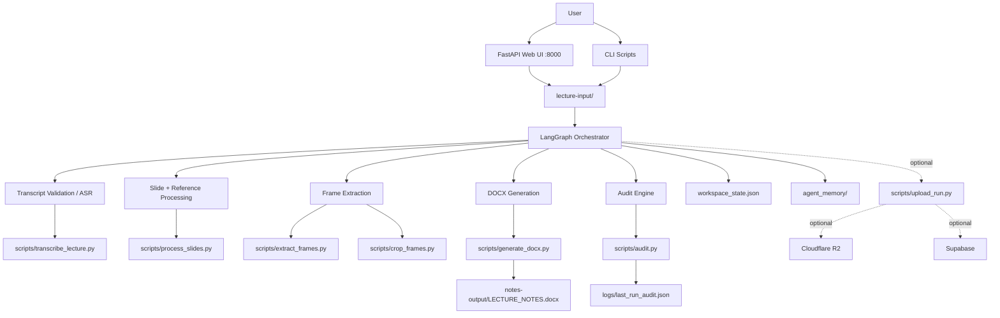

# Final Architecture: Current Repository Truth

## Executive Summary

This document describes the architecture that the repository currently implements, not an aspirational future platform.

- Runtime model: local-first Python pipeline
- Primary UI: FastAPI web app in `web_ui/app.py`
- Core orchestrator: `scripts/langgraph_orchestrator.py`
- Output target: `notes-output/LECTURE_NOTES.docx`
- Current working-tree audit: 22 gates
- Cloud services: optional post-generation upload, not core runtime dependencies

The previous version of this file described a different product shape: Next.js, Redis, direct R2 uploads, and a 15-gate system. That did not match the code in this repository.

## Actual System Diagram



## Core Components

### 1. Orchestrator

File: [scripts/langgraph_orchestrator.py](/Users/tejasmahadik/Documents/agentic-lecture-notes/scripts/langgraph_orchestrator.py:1)

Responsibilities:
- Discover active transcript, video, and slide inputs from `lecture-input/`
- Validate transcript completeness
- Trigger local ASR when transcript is missing or truncated
- Build or reuse concept/frame manifests
- Run slide/reference processing
- Generate the DOCX
- Run audit routing and retries
- Update `workspace_state.json`
- Optionally trigger cloud upload after successful local generation

Important note:
- The working tree currently contains 22-gate logic. Historical docs referring to 15 or 19 gates are stale unless explicitly pinned to an older snapshot.

### 2. Web UI

File: [web_ui/app.py](/Users/tejasmahadik/Documents/agentic-lecture-notes/web_ui/app.py:1)

Current behavior:
- Serves a FastAPI-based browser UI
- Accepts lecture uploads
- Supports ASR-only transcription jobs
- Tracks status through JSON files under `agent_memory/status/`
- Streams logs by reading log files
- Cancels background jobs via process-group termination

Current limitations:
- The main `/process` route still requires a video upload
- Status tracking is file-based and local-process-based, not distributed
- This is not a Next.js frontend and does not currently use Redis

### 3. Document Generator

File: [scripts/generate_docx.py](/Users/tejasmahadik/Documents/agentic-lecture-notes/scripts/generate_docx.py:1)

Responsibilities:
- Convert concept blocks, visual manifests, and slide/reference data into `.docx`
- Apply note formatting, revision boxes, examples, quotes, clozes, tables, and highlights
- Insert screenshots inline
- Record inserted image metadata for audit

Important implementation detail:
- The generator now writes `inserted_images.json` with DOCX metadata so audits can reject stale image lists from an older run.

### 4. Audit Engine

File: [scripts/audit.py](/Users/tejasmahadik/Documents/agentic-lecture-notes/scripts/audit.py:1)

Current state:
- The working tree implements a 22-gate audit
- Audit output is written to `logs/last_run_audit.json`
- Audit metadata now includes DOCX fingerprint information for safer state handoff

Do not assume older prompts are correct:
- Earlier prompts and docs in this repo describe 15-gate and 19-gate variants
- The code is the source of truth for the active gate set

### 5. Slide and Reference Processing

File: [scripts/process_slides.py](/Users/tejasmahadik/Documents/agentic-lecture-notes/scripts/process_slides.py:1)

Responsibilities:
- Render `SLIDES.pdf` into images and OCR them
- Render `REFERENCE_NOTES.pdf` or text notes into manifests
- Extract embedded screenshots from reference PDFs
- Reset stale reference manifests when no reference notes are present

### 6. ASR / Transcription

File: [scripts/transcribe_lecture.py](/Users/tejasmahadik/Documents/agentic-lecture-notes/scripts/transcribe_lecture.py:1)

Current flow:
- Primary path: local MLX Qwen3-ASR
- Fallback path: SoundScribe integration
- Writes `transcript.txt` and `transcript.srt`
- Validates transcript coverage against media duration

Recent hardening:
- Fallback now requires both TXT and SRT output
- Fallback SRT is checked for duration coverage before success is reported

### 7. Optional Cloud Upload

Files:
- [scripts/upload_run.py](/Users/tejasmahadik/Documents/agentic-lecture-notes/scripts/upload_run.py:1)
- [scripts/cloud_uploader.py](/Users/tejasmahadik/Documents/agentic-lecture-notes/scripts/cloud_uploader.py:1)

What this is:
- A post-success optional sync layer

What this is not:
- It is not required to generate notes locally
- It is not the primary storage plane for the current repo

Current safeguards:
- 9 GB R2 safety limit is preserved
- Upload failures for transcript/slides now count as real failures
- Supabase logging now uses `upsert` with retries

## Actual Runtime Dependencies

### Required Local Dependencies

- Python 3.11
- `requirements-mcp.txt`
- `ffmpeg`
- `tesseract-ocr`
- `poppler-utils`

### Docker

Files:
- [Dockerfile](/Users/tejasmahadik/Documents/agentic-lecture-notes/Dockerfile:1)
- [docker-compose.yml](/Users/tejasmahadik/Documents/agentic-lecture-notes/docker-compose.yml:1)

Current Docker reality:
- The repo currently defines a single `pipeline` service in `docker-compose.yml`
- It does not define the multi-container web + Redis + MCP + DB topology described in older architecture docs

## Current Data Flow

### Inputs

Active input directory:
- `lecture-input/`

Common active files:
- `LECTURE.mp4`
- `transcript.srt`
- `SLIDES.pdf`
- `REFERENCE_NOTES.pdf`

### Generated Working Artifacts

Root-level manifests:
- `concept_block_map.json`
- `frame_manifest.json`
- `slide_manifest.json`
- `reference_manifest.json`
- `embedded_manifest.json`
- `inserted_images.json`
- `workspace_state.json`

Generated output:
- `notes-output/LECTURE_NOTES.docx`

### State and Logs

- `workspace_state.json`: active lecture and pipeline handoff state
- `logs/last_run_audit.json`: latest audit outcome with metadata
- `logs/langgraph_checkpoints.db`: LangGraph checkpoint DB
- `agent_memory/`: run/failure history

## What Is Not True Anymore

The repository does not currently implement the following as described in the previous architecture draft:

- Next.js 16 frontend
- Redis-backed queue/event bus
- direct browser-to-R2 upload pipeline
- always-on Docker microservice split for three MCP servers plus web plus Redis
- 15-gate active audit as the current runtime truth
- mandatory multi-user Supabase auth as a required local runtime dependency

Those may be future directions, but they are not the architecture the current code executes.

## Deployment Guidance

### Current Reliable Local Start

Web UI:

```bash
python web_ui/app.py
```

CLI pipeline:

```bash
python scripts/langgraph_orchestrator.py
```

### Current Docker Reality

```bash
docker-compose build
docker-compose up pipeline
```

If you need the docs to describe a future cloud product, create a separate `TARGET_ARCHITECTURE.md`. Do not overwrite current-state documentation with aspirational system design.

## Recommended Documentation Split

To keep this repo understandable, maintain three distinct documents:

1. `FINAL_ARCHITECTURE.md`
   Current implemented architecture only.
2. `TARGET_ARCHITECTURE.md`
   Desired future platform architecture.
3. `ISSUES_REGISTRY.md`
   Drift, bugs, and migration blockers between current and target state.

