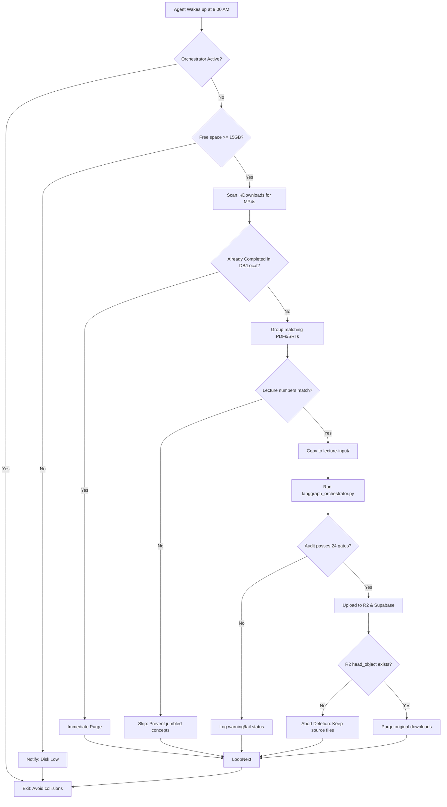

# Antigravity Scheduled Tasks — Daily Ingestion & Note Reconstruction Spec

This document details how to configure a recurring background Scheduled Task in the Antigravity UI to automate the daily lecture note generation pipeline.

---

## 1. Setup Instructions in Antigravity UI

To schedule the daily run, open the **Scheduled Tasks** menu in the Antigravity sidebar, click **+ New**, and configure the fields exactly as follows:

| Field | Configuration |
| :--- | :--- |
| **Name** | `Daily Lecture Ingestion and Note Reconstruction` |
| **Project** | `Agentic Lecture notes Final` |
| **Schedule** | `Daily` around `9:00 AM` *(Note: Must fall within the 7 AM - 1 PM pipeline execution window)* |
| **Prompt** | *Copy and paste the exact prompt block from Section 2 below.* |

---

## 2. The Scheduled Task Prompt (Copy-Paste)

```markdown
Role: Daily Lecture Note Ingestor and Quality Auditor

Task:
Every day at 9:00 AM, scan the user's local downloads folder (~/Downloads) for unprocessed lecture videos (.mp4), locate matching slides/reference PDFs and transcripts, run the end-to-end notes reconstruction pipeline, verify compliance with the 24-gate quality audit, upload output artifacts to R2 and Supabase, and safely purge processed downloads under strict 2-phase commit constraints.

### 1. Ingestion & File Association Rules
1. Check the local `~/Downloads/` directory for any raw `.mp4` video files.
2. For each video found, locate matching support files (PDF slides, handwritten reference notes, `.srt` or `.txt` transcripts) in the same directory using keyword overlap and lecture number matching:
   - Ensure the lecture numbers match (e.g., "Live-20" or "Lec-20").
   - Mismatched lecture numbers (e.g. a "Live-20" video and a "Sentence-Rearrangement-2" PDF) must NEVER be grouped or processed together.
   - If multiple PDFs match, identify the reference notes PDF by looking for keywords like "notes", "reference", "handwritten", "tejas", "scribble".
3. Transcript source fallback:
   - Check if a transcript `.srt` is already in `~/Downloads/`.
   - If not, look under `~/SoundScribe/` for matching `.soundscribejob` directories containing `manifest.json`. Translate manifest timestamps to standard SRT and compile `lecture-input/transcript.srt`.
   - If neither exists, let the orchestrator run local Qwen3-ASR transcription.

### 2. Pipeline Execution
1. Run the downloads tracker in retry mode to pick up backlog items and clear stuck status:
   `venv/bin/python scripts/downloads_tracker.py --retry-failed`
2. This script handles:
   - Ingesting matching files to `lecture-input/`
   - Checking host disk space (fails if free space < 15.0 GB)
   - Running the LangGraph orchestrator (`scripts/langgraph_orchestrator.py`)
   - Cleaning up temporary cache folders after run

### 3. Student-Grade Note Quality Constraints
Ensure that the notes generated by the pipeline adhere strictly to the restructured v2.0 design:
1. **Target Word Count**: Between 2,500 and 3,500 words for a 1-hour lecture (strict hard ceiling of 4,000 words). Eliminate transcript dumps and bloated prose.
2. **Minimal Callouts**:
   - Cautions, traps, and tricks must ONLY be extracted when explicitly flagged by the teacher in the transcript.
   - Limit total callouts (cautions/traps/tricks/quotes) to at most 6 per document.
   - Capped teacher quotes to at most 1 per block.
   - Per-example student notes, analogies, and revision boxes are strictly disabled.

### 4. Safe 2-Phase Commit Purge Policy
Do NOT delete any raw files from `~/Downloads/` unless:
1. The 24-gate quality audit passes with exit code 0 (`venv/bin/python scripts/audit.py --docx notes-output/LECTURE_NOTES.docx`). Gate 23 (word count budget <= 5,000) and Gate 24 (callout box count <= 20) are hard fail gates.
2. Cloud R2 object storage verification checks successfully confirm that `notes.docx` exists in the bucket and contains a non-zero byte size.
3. The Supabase table logs the run as "completed".

Security checks:
- Verify that deleted file paths resolve using realpath and reside inside `~/Downloads/`.
- Symlinks are strictly banned. Never follow or delete symlinks.

### 5. Error Reporting & Notification
- Send a native macOS desktop notification ONLY on pipeline execution failures or critical disk space errors.
- Do NOT spam notifications on success or warnings (error-only policy).
```

---

## 3. Core System Flow & Guardrails

The scheduled task prompt relies on the single source of truth: `scripts/downloads_tracker.py`. The diagram below shows how the agent executes the task and how the safeguards prevent data loss:



### Key Safeguards Explained

1. **Host Disk Space Guard**: Before copying any files or running transcription, the script validates that the host disk has at least 15 GB of free space. This prevents compilation and image extraction failures from filling up the disk.
2. **Reconciliation & Stale-Job Purging**: The pipeline query fetches all completed runs from Supabase. If an unprocessed video file in `~/Downloads` is found to have a corresponding completed status in the database (or is already generated locally), it is immediately deleted to free up local storage.
3. **Path Traversal Protection**: The deletion loop uses `os.path.realpath` to confirm that the file is located strictly inside `~/Downloads/`. Under no circumstances will the tracker delete files from project folders, root levels, or symlinked paths.
4. **2-Phase Commit Verification**: Original files are deleted ONLY after the generated Word document passes the 24 quality audit gates and is successfully checked for a non-zero byte size on R2. If either the audit fails or the upload is interrupted, the original files are preserved.
